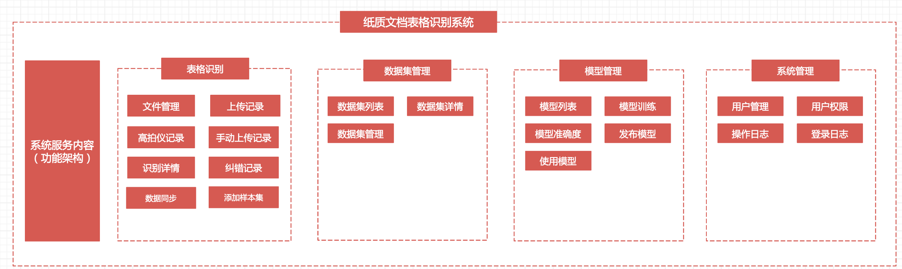
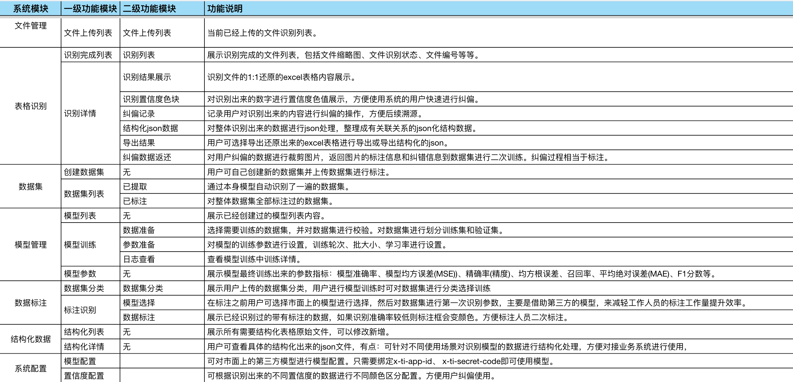

- 智能OCR表格识别体验地址：http://techflag.cn/?from=gitee

产品介绍
旗讯智能 OCR 表格识别深度融合先进的 OCR 技术与精细的机器学习算法，将传统纸质样品表格检验流程彻底升级为自动化、智能化的高效体系。其搭载的多项核心功能，全方位满足各类表格处理需求。高效的数据采集与结构化处理能力，可快速抓取表格中的关键信息，并按照预设规则进行结构化整理，将杂乱无章的原始数据转化为有序、可分析的数据资产。精准的数据识别与校对机制，从企业财务报表处理、政府档案数字化，到教育机构成绩单管理、医疗行业病历归档，旗讯智能 OCR 表格识别都能发挥重要作用，助力各行业提升数据处理效率，降低人力成本，加速数字化转型进程。
 **支持企业级用户与涉密单位本地化部署。** 

## 系统架构

## 功能架构

## 功能清单

## 产品体验：http://techflag.cn/
体验地址：

## 安装视频
后续增加

## 产品截图

## 应用场景
### 制造业
#### 车间生产记录表智能识别 
车间是制造业核心生产区域，生产记录表详细记录每日产量、生产进度、原料使用等信息。以往，工人手写记录后，需专人录入系统，耗时耗力且易因字迹潦草或录入疏忽产生错误。表格识别可快速精准识别生产记录表上手写内容，将产量、工时、次品率等数据瞬间转化为电子数据，自动录入企业生产管理系统。数据实时、准确呈现，管理人员能及时掌握生产动态，发现潜在问题，合理安排生产计划，提升生产效率与管理水平。
#### 设备维护日志高效处理 
设备正常运行是制造业稳定生产的关键，设备维护日志记录设备保养、维修情况。设备维护人员日常手写日志，内容包括维护时间、故障现象、维修措施等。表格识别可迅速提取日志中的关键信息，如设备编号、故障频率、维修时长等。企业通过对这些数据的分析，能预测设备故障，提前制定维护计划，减少设备停机时间，延长设备使用寿命，降低设备运维成本。
#### 质量检验报告精准解读 
质量是制造业的生命线，质量检验报告记录产品各项质量指标检测结果。检验人员手写报告后，表格识别系统可快速准确识别报告中的数据，如尺寸偏差、化学成分含量、性能参数等。通过与质量标准数据库对比，系统能自动判定产品是否合格，对不合格产品精准定位问题指标。这不仅提高质量检验效率，还为质量追溯和持续改进提供可靠数据支持，助力企业打造高质量产品，提升市场竞争力。

### 科研机构
#### 实验数据表的高效数字化
科研实验往往会产生大量复杂的数据表，记录着各种实验参数、测量结果等。科研人员手写记录后，需要花费大量时间将数据录入电子表格以便分析。表格识别能够快速准确地识别实验数据表中的各类数据，无论是物理实验中的精确测量值，还是化学实验中的成分比例数据，都能瞬间转化为可编辑、可分析的电子数据。这不仅大大节省了科研人员的数据录入时间，还减少了人工录入可能出现的错误，确保数据的准确性，使科研人员能够将更多精力投入到数据分析和科研创新中。
#### 研究观察记录的精准提取
科研观察是获取新知识的重要途径，研究人员在观察过程中会详细记录各种现象、变化等信息。这些手写的观察记录往往内容丰富但格式不统一，整理起来较为困难。表格识别可以精准提取研究观察记录中的关键信息，比如生物学研究中的动植物生长变化、天文学观测中的天体现象等。通过对这些信息的快速识别和分类整理，科研人员能够更方便地回顾和对比不同阶段的观察结果，加速研究进程，促进科研成果的产出。
#### 检测报告处理的智能化升级
实验室检测报告包含着严谨的检测数据和分析结论，对科研项目的推进至关重要。传统方式下，科研人员需要手动提取报告中的关键数据，不仅耗时费力，还容易遗漏重要信息。表格识别系统能够自动识别检测报告中的各项指标数据、检测方法、结论等内容，快速生成结构化的数据文档。这使得科研人员能够迅速获取所需信息，进行跨报告的数据整合与对比分析，为科研决策提供更有力的数据支持，助力科研项目高效推进。

### 医疗卫生 
#### 病历记录识别：精准医疗的基石
病历是患者健康信息的核心载体，涵盖患者基本情况、病史、诊断结果、治疗过程等海量信息。医生手写病历字迹有时难以辨认，且人工录入耗时久。表格识别能快速准确识别病历中的文字信息，无论是复杂的病情描述，还是专业的医学术语，都能精准转化为电子数据。这使得医生在查房、会诊时可快速调用患者完整病历，为诊断和治疗方案制定提供全面、准确依据，提升医疗服务质量，降低误诊漏诊风险。同时，数字化病历便于存储和检索，为医疗大数据分析、医学研究提供丰富数据源。
#### 检查单处理：加速诊疗流程
医疗检查单包含各类检验、检查结果，如血液检查、影像诊断等。患者就诊时，检查单数量多且分散，医护人员需花费时间整理和录入数据。表格识别可迅速提取检查单上的关键数据，如检验指标数值、影像诊断结论等，并自动关联患者信息，快速整合到电子病历系统中。医生能及时获取完整检查结果，加速诊疗决策，患者也能更快得到治疗方案，优化就医体验，提升医院整体诊疗效率。
#### 护理记录表：优化护理管理
护理记录详细记载患者住院期间生命体征、护理措施、病情变化等情况。护士日常手写护理记录后，表格识别系统可将这些信息快速数字化。护士长及管理人员可通过系统便捷查看护理记录，实时掌握患者护理情况，监督护理工作质量。同时，数字化的护理记录便于进行数据分析，如统计患者常见问题、护理工作量等，帮助医院合理安排护理资源，制定更科学的护理计划，为患者提供更优质的护理服务。

### 金融行业 
#### 票据自动识别：加速业务流转
金融业务中，票据如支票、汇票、本票等种类繁多且数量庞大。人工审核票据信息，如金额、日期、出票人等，不仅效率低，还可能因疲劳或疏忽导致错误。表格识别系统可快速准确识别票据上的各类信息，瞬间完成信息录入与核验。在银行日常票据处理业务中，能大幅缩短票据处理时间，加快资金清算速度，提升客户服务体验。同时，系统可自动将识别信息与银行内部系统数据进行比对，及时发现异常票据，有效防范金融风险。
#### 合同信息提取：保障合规与效率
金融合同涉及大量法律条款、业务细节和客户信息，从合同中提取关键信息是一项繁琐且重要的工作。表格识别能够精准提取合同中的合同金额、期限、利率、双方权利义务等核心内容，自动生成结构化数据。这有助于法务人员快速审核合同合规性，业务人员及时掌握关键业务信息，避免因人工查找信息遗漏或错误带来的风险。此外，数字化的合同信息便于存储和检索，当需要查询历史合同或进行合同数据分析时，能快速定位和提取所需信息，为金融机构业务决策提供有力支持。
#### 报表数据分析：洞察金融趋势
金融机构每月、每季度都会生成大量财务报表、业务报表等，包含资产负债、营收利润、客户数据等海量信息。表格识别可将报表中的数据快速转化为电子数据，导入专业数据分析工具。分析师能够利用这些准确、完整的数据进行深入分析，如进行财务比率分析、业务趋势预测、客户行为分析等。通过对报表数据的智能化处理，金融机构能够及时洞察市场动态，发现潜在业务机会，优化资源配置，提升自身竞争力，在复杂多变的金融市场中占据有利地位。

### 教育行业 
#### 答题卡识别：精准、高效判卷
考试是教育教学中检验学生知识掌握情况的重要环节。传统答题卡判卷需人工逐一核对涂写答案，耗时久且易出现误判。表格识别系统可快速准确识别答题卡上的填涂内容，无论是客观题的答案选项，还是主观题的手写答题区域，都能精准识别。系统能自动与标准答案进行比对，迅速给出成绩，大幅缩短判卷时间，提高考试结果反馈效率。同时，准确的判卷结果为教师分析学生知识薄弱点、调整教学策略提供可靠依据，助力教学质量提升。
#### 作业批改辅助：减轻教师负担
教师日常需批改大量学生作业，涵盖各类题型和手写内容，工作繁重。旗讯智能 OCR 表格识别可对学生作业进行批量识别，将作业中的文字、算式等内容转化为电子数据。对于客观题，系统可自动批改；对于主观题，教师可在电子界面上便捷批注，标记错误、书写评语等。这不仅减轻了教师批改作业的工作量，让教师有更多时间投入到教学设计和学生个性化辅导中，还能使作业批改反馈更加及时，帮助学生及时纠正错误，巩固知识。
#### 成绩单处理：智能管理学生成绩
每学期学校都会生成大量学生成绩单，记录学生各科成绩、排名等信息。传统方式下，制作和整理成绩单需人工录入成绩、计算总分和平均分等，容易出现数据错误。表格识别能快速读取纸质成绩单上的成绩信息，自动进行数据录入和统计分析，生成规范的电子成绩单。学校管理人员可通过系统便捷查询、管理学生成绩，生成成绩报表和分析图表，为教学评估、学生学业跟踪提供数据支持。同时，家长和学生也能更方便地获取成绩信息，了解学习情况，促进家校共育。

### 物流行业 
#### 运单自动录入：加速订单处理
物流运单包含发货人、收货人、货物信息、运输路线等大量关键内容。以往，工作人员需手动录入运单信息，不仅耗费大量时间，还容易因字迹不清或录入失误导致信息错误。表格识别系统能快速准确识别运单上的各类信息，自动录入物流管理系统。这大大缩短了运单处理时间，使货物能更快进入运输流程，提升物流时效性。同时，准确的运单信息录入减少了因信息错误导致的运输延误、错发等问题，提高了客户满意度。
#### 库存清单识别：优化仓储管理
仓储环节中，库存清单记录着货物的种类、数量、存放位置等信息。仓库管理人员定期盘点库存并更新清单，传统手写记录和人工录入方式效率低下，且在库存信息频繁变动时难以及时准确更新。表格识别可快速读取纸质库存清单上的信息，将其转化为电子数据并自动同步到仓储管理系统中。管理人员通过系统能实时掌握库存动态，合理安排货物存储和调配，避免库存积压或缺货情况，提高仓储空间利用率和货物周转效率。
#### 配送单据处理：提升配送准确性
配送单据是货物从仓库到客户手中的重要凭证，包含配送地址、收件人联系方式等关键信息。表格识别系统能够精准识别配送单据上的信息，自动核对配送地址和收件人信息是否准确。这有助于配送人员提前规划最优配送路线，减少因地址错误导致的配送延误和成本增加。同时，系统可将识别后的配送单据信息与物流追踪系统关联，客户能实时查询货物配送状态，提升物流服务的透明度和客户体验。